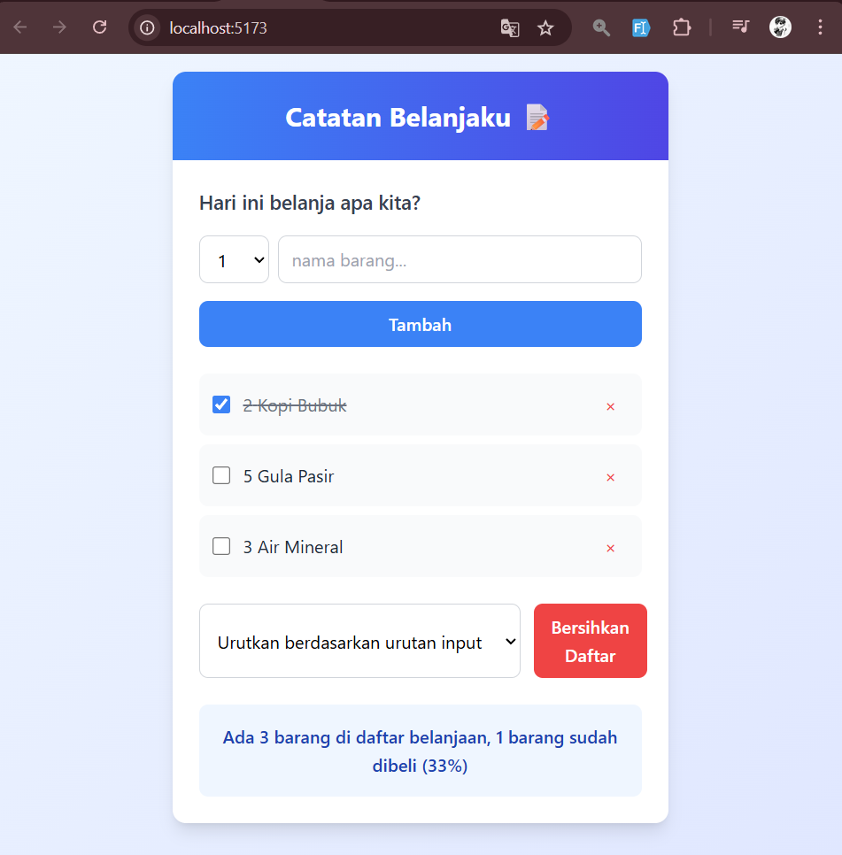

# 📝 Catatan Belanjaku

Aplikasi sederhana untuk mencatat kebutuhan belanja harian dengan fitur interaktif seperti menambahkan, mencentang, menghapus, serta mengurutkan daftar belanja.

## ✨ Fitur Utama

- Tambah item belanja beserta jumlahnya
- Centang item yang sudah dibeli
- Hapus item dari daftar
- Bersihkan seluruh daftar belanja
- Urutkan berdasarkan:
  - Urutan input
  - Nama barang
  - Status dibeli (checked)
- Menampilkan statistik jumlah total dan persentase item yang sudah dibeli

## 📸 Tampilan



## 🛠️ Teknologi

- React (Vite)
- Tailwind CSS

## 🚀 Cara Menjalankan Proyek

1. Clone repositori ini:
   ```bash
   git clone https://github.com/fithnanriatan/catatan-belanja.git
   cd catatan-belanja
   ```

2. Install dependency:
   ```bash
   npm install
   ```

3. Jalankan proyek:
   ```bash
   npm run dev
   ```

4. Buka browser dan akses:
   ```
   http://localhost:5173
   ```


## 📌 Catatan Tambahan

- Setiap item memiliki struktur:
  ```js
  {
    id: Number,
    name: String,
    quantity: Number,
    checked: Boolean
  }
  ```
- `id` menggunakan `Date.now()` saat item ditambahkan.
- Komponen dirancang dengan pendekatan _functional component_ menggunakan _React hooks_.

## 📬 Kontribusi

Silakan buat _pull request_ atau _issue_ jika ingin berkontribusi, menambahkan fitur, atau melaporkan bug.

---

**Selamat mencatat belanja dan selamat berbelanja!**